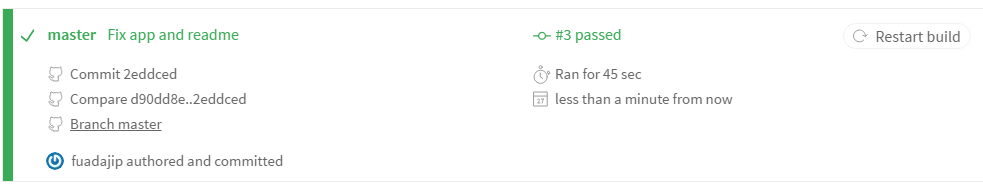

# SIMPLE TRAVIS CI

#   

This app is used to implement in Travis CI, show how build test continously processed.

## Status

## Setup
    npm install
    npm run test

# Travis CI Proccess
## Error Build
#   

# Success Build
#   

