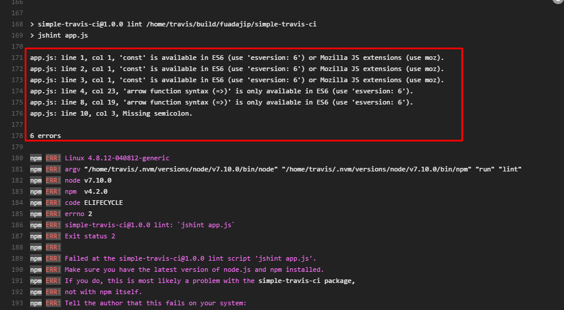

# SIMPLE TRAVIS CI

This app is used to implement in Travis CI to show how build test continously processed.

## Setup
    npm install
    npm run test

## Travis CI Proccess
# Error Build
#   

# Success Build

